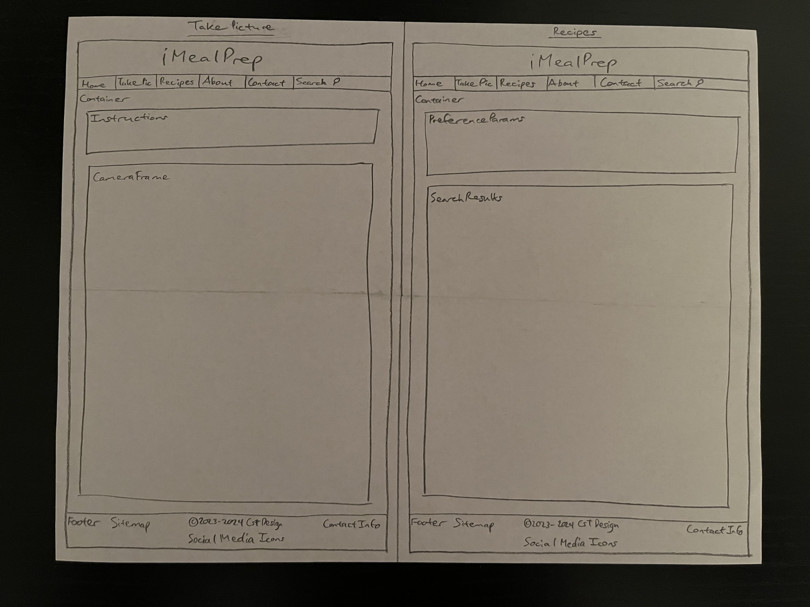
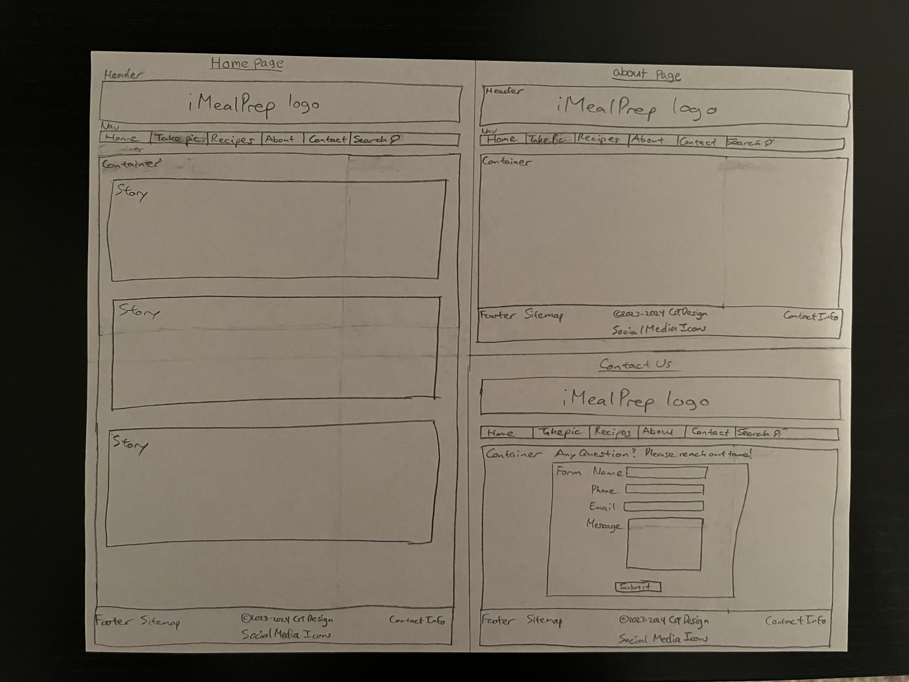

#iMealPrep
---
##Definition Statement
- I want to build the app iMealPrep to help make meal prep easier without the constant grocery store trips for ingredients. Using your phone or tablet's camera, you can shoot pictures of foods in your fridge, freezer, or pantry, then let iMealPrep give you recipe suggestions based on the pictures you have taken.

##Target Audience
- iMealPrep is perfect for anybody who enjoys cooking, whether you are a personal trainer, love to stick to a meal prep routine, or looking to improve your health and fitness.
---
##Pages

###Home
- The Home page will feature anything related to food, whether it's blog entries from your favorite chefs, healthier alternatives to specific ingredients, or even new recipes.

###Recipes
- The Recipes page will allow new users to enter their dietary preferences prior to taking pictures of their food. Account holders can change their preferences at will.
  - Diet preferences (keto, vegetarian, paleo, etc)
  - Fitness preferences (build muscle, lose weight, maintain frame)
  - Food allergens (wheat, soy, shellfish, etc).
  - Medical nutrient restrictions (low fat, low cholesterol, low cal, etc)
  - Filter macros (calorie, fat, carbs, protein)
  - Ingredient swaps (ex: Greek yogurt ILO butter)
- Once preferences are entered, you can use the camera to snp pics of as many food items as you wish. The app will then suggest recipes based on the picture(s) and preferences entered previously.

###About
- The About page will provide the story behind iMealPrep.

###Contact
- Use the Contact page to email your questions, suggestions, recipe(s) you made after using this app, etc
---
##Research

###Competing Apps
1. SuperCook (https://www.supercook.com/#/desktop)
  - Liked:
    - Ease of use
    - Suggests other ingredients to include with search results
    - Overabundance of selections from pantry
    - Color scheme
  - Disliked:
    - Overabundance of selections from pantry
    - Cannot filter allergens

2. MyFitnessPal (https://www.myfitnesspal.com/)
  - Liked:
    - Recipes show breakdown of macros
    - Color scheme
  - Disliked:
    - Multiple features require Premium membership

3. Eat This Much (https://www.eatthismuch.com/)
  - Liked:
    - Ease of use
    - Recipes show breakdown of macros
    - Color scheme
  - Disliked:
    - Multiple features require Premium membership
    - Recipe list not as extensive

###How My App Differs
- You can snap pictures of foods to receive recommendations for recipes.
- Suggested ingredient swaps if going for healthier spin on said recipe.
---
##SWOT Analysis

###Strengths
- My first time creating an app.
- Future opportunities to go further with app beyond this class, if desired.
- New way to provide suggestions for recipes.

###Weaknesses
- My first time creating an app.
- Work/life balance.
- Too harsh on myself if something goes wrong.

###Opportunities
- New app for meal preppers, bodybuilders, and weight loss patients to try their hand at making recipes.
- Future opportunities to go further with app beyond this class, if desired.
- Be proud of taking a new endeavor and sharing my progress.

###Threats
- Work/life balance.
- Potential problems with code.
- Pressure.
---
##Mural URL
- https://app.mural.co/t/savvycoders7390/m/savvycoders7390/1699581554000/e84b2d5e7db8f3616a8c0b2697cbaeb22a406909?sender=uadbae1889226f14801094013

##User Flow Chart

##Wire Frames
 